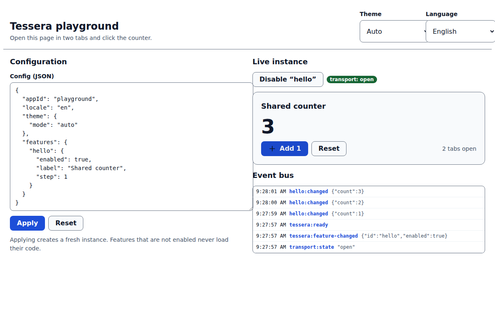

<h1 align="center">tessera</h1>

<p align="center"><b>Build apps from pieces.</b> The plugin core behind the Tessera feature kits: chat, video, comments, kanban, notes, an editor, annotation and maps that you switch on with configuration.</p>

<p align="center">
  <a href="https://github.com/thakurabhishek7283/tessera/actions/workflows/ci.yml"></a>
  <a href="LICENSE"></a>
  · <a href="https://thakurabhishek7283.github.io/tessera/playground/">Live playground</a>
  · <a href="https://thakurabhishek7283.github.io/tessera/">Docs</a>
</p>

<p align="center"></p>

## Why

Most apps need the same handful of collaborative features, and each one usually arrives with its own state management, its own backend assumptions and its own framework wrapper. Tessera puts them behind one small contract. You describe the features you want in a config object, pick where data lives (browser only, the reference server, or your own backend) and drop the elements into any framework. A feature you do not enable never loads its code.

## What is in this repository

| Package | Purpose |
| --- | --- |
| [`@tessera-kit/core`](packages/core) | Plugin host, config schema, event bus, service registry, stores, undo history, i18n, adapter interfaces |
| [`@tessera-kit/protocol`](packages/protocol) | Zod schemas for the WebSocket protocol and REST DTOs |
| [`@tessera-kit/transport`](packages/transport) | `local` (BroadcastChannel) and `websocket` transports |
| [`@tessera-kit/storage`](packages/storage) | Memory, localStorage, IndexedDB and REST storage; upload adapters; `createCollection` |
| [`@tessera-kit/elements`](packages/elements) | `TesseraElement`, `<tessera-root>`, design tokens and 18 accessible UI primitives |
| [`@tessera-kit/react`](packages/react) | `TesseraProvider` and hooks |
| [`@tessera-kit/testing`](packages/testing) | `FakeHub`, fake clock, fixtures, `createTestInstance` |

The kits live in their own repositories and depend only on these packages: [tessera-workspace](https://github.com/thakurabhishek7283/tessera-workspace) (editor, notes, kanban), [tessera-realtime](https://github.com/thakurabhishek7283/tessera-realtime) (presence, chat, video, comments) and [tessera-visual](https://github.com/thakurabhishek7283/tessera-visual) (annotator, maps), with [tessera-server](https://github.com/thakurabhishek7283/tessera-server) as the reference backend.

## Features

- **Configuration-driven.** `features: { chat: { enabled: true } }`. Enable and disable at runtime; elements show and hide themselves.
- **Lazy by construction.** Plugins are loaded through `() => import(...)` and only for enabled features.
- **Validated everywhere.** Config, feature options, stored documents and wire frames go through zod, and errors name the offending path.
- **Swappable adapters** for auth, transport, storage and uploads, with one shared behaviour contract that every storage adapter passes.
- **Works offline.** The local transport and IndexedDB storage make demos run without a server, and tabs stay in sync.
- **Accessible primitives.** Keyboard-operable menus, dialogs and form controls; colour tokens checked for WCAG 2.2 AA in light and dark; axe-core in the component tests.
- **Typed extension points.** Kits extend `FeatureApiMap`, `ServiceMap` and `TesseraEvents` through declaration merging.

## Quick start

```sh
pnpm add @tessera-kit/core @tessera-kit/elements @tessera-kit/transport @tessera-kit/storage
```

> The packages are not on npm yet. Until they are, link them from this repository (see [Development](#development)).

### Any framework (Web Components)

```html
<script type="module">
  import { createTessera } from '@tessera-kit/core';
  import { createStorage, createUploads } from '@tessera-kit/storage';
  import { createTransport } from '@tessera-kit/transport';
  import '@tessera-kit/elements/define';

  const tessera = createTessera(
    {
      appId: 'my-app',
      transport: { type: 'local' },
      storage: { type: 'indexeddb' },
      features: { hello: { enabled: true, label: 'Shared counter' } },
    },
    {
      plugins: { hello: () => import('./hello/plugin.js') },
      adapters: { transport: createTransport, storage: createStorage, uploads: createUploads },
    },
  );
  document.querySelector('tessera-root').tessera = tessera;
</script>

<tessera-root><tessera-hello></tessera-hello></tessera-root>
```

The `hello` feature is the example plugin in [`apps/playground`](apps/playground/src/hello). It is also the walkthrough in [Writing a plugin](https://thakurabhishek7283.github.io/tessera/guide/writing-a-plugin).

### React

```tsx
import { TesseraProvider, useFeature } from '@tessera-kit/react';

function Counter() {
  const hello = useFeature('hello'); // undefined while the feature is off
  return hello ? <tessera-hello /> : null;
}

export const App = () => (
  <TesseraProvider config={config} plugins={plugins} adapters={adapters} fallback={<p>Loading…</p>}>
    <Counter />
  </TesseraProvider>
);
```

### With other Tessera kits

```ts
createTessera(
  {
    appId: 'my-app',
    transport: { type: 'websocket', url: 'wss://example.com/v1/ws' },
    storage: { type: 'rest', baseUrl: 'https://example.com' },
    features: { chat: { enabled: true }, kanban: { enabled: true }, video: { enabled: false } },
  },
  { plugins: { chat: () => import('@tessera-kit/chat'), kanban: () => import('@tessera-kit/kanban'), video: () => import('@tessera-kit/video') }, adapters },
);
```

## Configuration

| Option | Type | Default | Description |
| --- | --- | --- | --- |
| `appId` | `string` | required | Namespace for storage keys and rooms (`[a-z0-9-]{1,40}`) |
| `features` | `Record<string, { enabled: boolean, … }>` | required | Feature id → options. Each plugin validates its own |
| `auth` | `static` · `guest` · `custom` | `guest` | Who the user is |
| `transport` | `none` · `local` · `websocket` · `custom` | `none` | How tabs and servers talk |
| `storage` | `memory` · `local` · `indexeddb` · `rest` · `custom` | `memory` | Where documents live |
| `uploads` | `dataurl` · `rest` · `custom` | `dataurl` | Where files go |
| `theme` | `{ mode, tokens }` | `auto` | Light/dark and CSS token overrides |
| `locale`, `messages` | | browser locale | Language and string overrides |

The [full reference](https://thakurabhishek7283.github.io/tessera/reference/configuration) is generated from the schema, so it cannot drift.

## Events and API

The instance returned by `createTessera` offers `ready`, `feature(id)`, `featureStatus(id)`, `enable(id, config?)`, `disable(id)`, `on(event, fn)`, `setTheme(mode)`, `setLocale(locale)`, `getTheme()` and `destroy()`.

| Bus event | Payload |
| --- | --- |
| `tessera:ready` | none |
| `tessera:error` | `TesseraError` (a failing feature does not stop the others) |
| `tessera:feature-changed` | `{ id, enabled }` |
| `tessera:theme-changed` | `{ mode, resolved }` |
| `tessera:locale-changed` | `{ locale }` |
| `auth:user-changed` | `UserInfo \| null` |
| `transport:state` | `idle` · `connecting` · `open` · `reconnecting` · `closed` |

Each package README lists its API, options and (for elements) events, CSS parts and slots.

## Architecture

```text
config ─▶ createTessera ─▶ plugin host ─▶ enabled kits (lazy)
                │              │
                │              └─ bus · services · i18n · theme
                └─ adapters: Auth · Transport · Storage · Uploads
                              │
              local tabs · tessera-server · your own backend
```

Kits never import each other; they cooperate through the service registry. See [`docs/architecture.md`](docs/architecture.md) and the decision records in [`docs/decisions`](docs/decisions).

## Development

Requires Node 22 and pnpm 10.

```sh
pnpm install
pnpm dev                 # the playground at http://localhost:5173
pnpm check               # lint, typecheck, unit tests, build
pnpm test:browser        # component tests in Chromium (Vitest browser mode)
pnpm e2e                 # Playwright against the built playground
pnpm docs:dev            # the documentation site
pnpm docs:gen            # regenerate the configuration reference from the schema
```

The browser and e2e tests need Chromium. In CI it is installed with `npx playwright install --with-deps chromium`; set `CHROMIUM_PATH` to use an existing binary.

To use the packages from another checkout before they are published, link the folders (`pnpm link` or a `link:` override in the consumer's `package.json`); the kit repositories do this through a small `deps.json` mechanism.

## Roadmap

- [x] Core: plugin host, bus, services, stores, history, i18n, config validation
- [x] Wire protocol and REST DTO schemas
- [x] Storage adapters (memory, localStorage, IndexedDB, REST) and uploads
- [x] Local and WebSocket transports with reconnect, queueing and heartbeat
- [x] Elements: base class, tokens, 18 primitives, controllers
- [x] React bridge and testing utilities
- [x] Playground, documentation site, end-to-end tests
- [ ] Publish to npm and remove the link-based development setup in the kit repositories
- [ ] Optional Yjs collaboration for the rich-text editor (stretch)

## Licence

MIT © Abhishek Thakur
